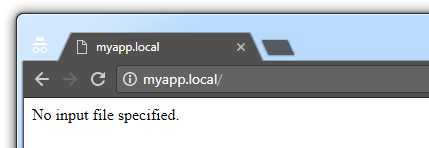
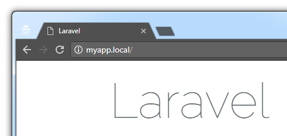

# Laravel Homestead Tutorial
Step-by-step instructions on setting up Homestead in Windows 7

## Introduction

[Homestead](https://laravel.com/docs/homestead) is a Vagrant box people use to develop [Laravel](https://laravel.com) apps.

Here's how you can get Homestead up and running in Windows 7. This is an alternative to the [official instructions](https://laravel.com/docs/homestead#installation-and-setup).

## Prerequisites

1. You're using Windows 7
2. You have [Git](https://git-scm.com/docs/git-clone) installed
3. You have [VirtualBox](https://www.virtualbox.org) and [Vagrant](https://www.vagrantup.com) installed
4. You have [PuTTY Key Generator](https://www.chiark.greenend.org.uk/~sgtatham/putty/latest.html) (a.k.a. `puttygen.exe`) on your computer

## Procedure

1. **Download and install the [Homestead Vagrant box](https://app.vagrantup.com/laravel/boxes/homestead)** into Vagrant

    ```bash
    $ vagrant box add laravel/homestead
    ```
    
    * During installation, when Vagrant asks you which provider you will be working with, select `virtualbox`
    * You can run `$ vagrant box list` to check which version of the box is installed
    
2. **Clone the Homestead Git repository**

    ```bash
    $ git clone https://github.com/laravel/homestead.git ./Homestead
    ```
    
    * That instructs Git to download the Homestead Git repository from GitHub, and store it in a folder named `Homestead` in the current directory
    
3. **Check out the latest stable commit** from the cloned repository

    * Prior to running the following commands, replace the `vX.Y.Z` with whichever tag is associated with the latest release of the repository (e.g. `v6.3.0`). The latest release of the repository is shown [here](https://github.com/laravel/homestead/releases/latest)
    * Finally, run the following commands:

    ```bash
    $ cd ./Homestead
    $ git checkout vX.Y.Z
    ```
    
    * The official instructions recommend doing that in case the commit checked out by default (i.e. the tip of the *master* branch) is in an insufficient state

4. **Generate the Homestead configuration file** (i.e. `Homestead.yaml`)

    * If using bash, run:

    ```bash
    $ bash init.sh
    ```
    
    * Alternatively, if using cmd.exe, run:
    
    ```dos
    init.bat
    ```
    
    * That instructs Windows to execute the instructions in that shell/Batch script, one of which is to create a Homestead configuration file (i.e. `Homestead.yaml`) in the current folder

5. **Generate an SSH key pair**

    * Launch `puttygen.exe` and generate an SSH key pair (e.g. *2048-bit RSA*)
    * Save the OpenSSH-formatted private key (via *Conversions > Export OpenSSH key*) onto your computer
    * Save the OpenSSH-formatted `authorized_keys` string (via copy/pasting it into a text file) onto your computer

6. **Create an app development folder**

    * If using bash, run:

    ```bash
    $ mkdir /c/path/to/myapps
    ```
    
    * Alternatively, if using cmd.exe, run:
    
    ```dos
    mkdir c:\path\to\myapps
    ```
    
    * That will create a folder named `myapps` in `c:/path/to/`
    * You can name your app development folder whatever you want, and store it wherever you want
    * Subsequent instructions will assume your app development folder is `c:/path/to/myapps`
    
7. **Edit the Homestead configuration file** (i.e. the `Homestead.yaml` file generated earlier)

    * Edit the fields shown below to have the values shown below:

    ```yaml
    provider: virtualbox
    
    authorize: c:/path/to/openssh_authorized_keys_string.txt
    
    keys:
        - c:/path/to/openssh_private_key.txt
        
    folders:
        - map: c:/path/to/myapps
          to: /home/vagrant/code
          
    sites:
        - map: myapp.local
          to: /home/vagrant/code/myapp/public
          
    databases:
        - homestead
    ```
    
    * Save the file

8. **Add an entry to the Windows `hosts` file**

    * **As an Administrator**, edit the file: `C:\Windows\System32\drivers\etc\hosts`
    * Add the following line to the file:
    
    ```hosts
    192.168.10.10 myapp.local
    ```
    
    * Save the file
    * That will allow you to visit your app at `http://myapp.local`

9. **Spin up the Vagrant box**

    * Inside your `Homestead` folder, run the following:

    ```bash
    $ vagrant up
    ```
    
    * That will spin up the Vagrant box and configure it (i.e. provision it) according to the settings defined in the Homestead configuration file
    * Once the Vagrant box has been provisioned, you will be able to visit [http://myapp.local](http://myapp.local) in your web browser. You may see a page there that says, "No input file specified." (screenshot below).
    
        
    
10. **Connect to the Vagrant box** via SSH

    ```bash
    $ vagrant ssh
    ```
        
11. **Create a Laravel app** on the Vagrant box

    ```bash
    $ cd /home/vagrant/code
    $ composer create-project --prefer-dist laravel/laravel myapp
    ```

    * That will create a Laravel app, whose files are stored in `/home/vagrant/code/myapp`

12. **Visit the app's homepage**

    * Using a web browser on your computer (i.e. not on the Vagrant box), visit [http://myapp.local](http://myapp.local)
    * You will see the app's homepage (i.e. the "Laravel" page)

        

13. **Done!**

## Versions

I used the following software versions when writing this document:
1. **Windows 7**: 64-bit with Service Pack 1
2. **Vagrant**: 1.9.6
3. **VirtualBox**: 5.1.14
4. **Homestead Vagrant box**: 3.1.0
5. **Homestead Git repository**: 6.3.0
6. **PuTTY Key Generator** (a.k.a. `puttygen.exe`): 0.68 (64-bit)
7. **Git**: 2.12.2.windows.2
